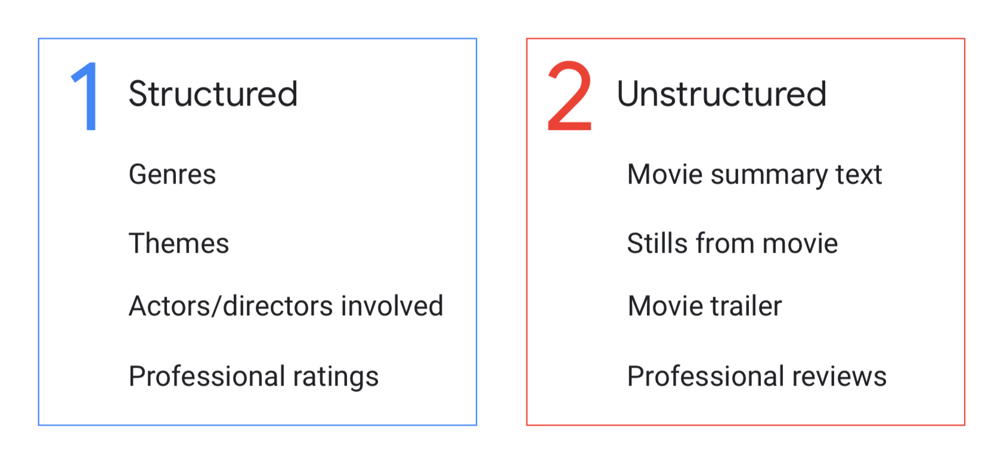
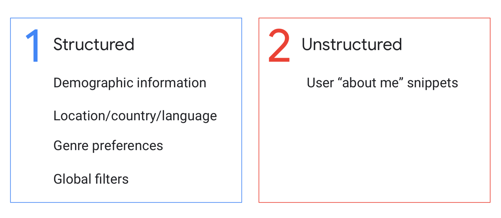
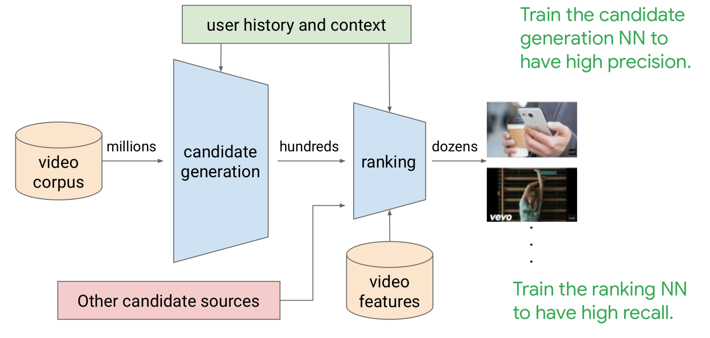

# ***Neural Network for Recommendation Systems***

So when we talk about Recomender System in the real-world we have to imagine an
hybrid system, in whitch Content-Based, Collaborative Filtering and knowledge-based are implement in the same model.

##***Structured and Unstructured Data***

***Content-based recommendation models***

***Collaborative filtering***

***Knowledge-based***

***Hybrid model***

##***Content-Based Filtering overview***
Uses item features to recommend new items that are similar to what the user has liked in the past. Content-based does not take into account the behavior or ratings of other users.

The user space and product space are ***sparse*** and ***skewed***. This means that most item are rated by very few users, and most users rate only a small fraction of items. Furthermore, some properties are very popular and some users are very prolific.

To feed a Neural Networks for Recommendetion System, cause of the sparse dataset we define the features columns to use in our model into a dense representation. TensorFlow allows us to do this using [various feature columns](https://www.tensorflow.org/api_docs/python/tf/feature_column).

***Examples of feature columns:***

- [`tf.feature_column.categorical_column_with_hash_bucket
`](https://www.tensorflow.org/api_docs/python/tf/feature_column/categorical_column_with_hash_bucket)
- [`tf.feature_column.embedding_column`](https://www.tensorflow.org/api_docs/python/tf/feature_column/embedding_column)

    items_id_column = tf.feature_column.categorical_column_with_hash_bucket(
    key="items_id",
    hash_bucket_size= len(content_ids_list) + 1)

    embedded_content_column = tf.feature_column.embedding_column(
    categorical_column=items_id_column,
    dimension=10)

- [`tf.feature_column.categorical_column_with_vocabulary_list
`](https://www.tensorflow.org/api_docs/python/tf/feature_column/categorical_column_with_vocabulary_list)
- [`tf.feature_column.indicator_column`](https://www.tensorflow.org/api_docs/python/tf/feature_column/indicator_column)

    category_column_categorical = tf.feature_column.categorical_column_with_vocabulary_list(
    key="category",
    vocabulary_list=categories_list,
    num_oov_buckets=1)

    category_column = tf.feature_column.indicator_column(category_column_categorical)

    We use the input_layer feature column to create the dense input layer to our network. We can adjust the number of hidden units as a parameter.

    net = tf.feature_column.input_layer(features, params['feature_columns'])
    for units in params['hidden_units']:
        net = tf.layers.dense(net, units=units, activation=tf.nn.relu)
     #Compute logits (1 per class).
    logits = tf.layers.dense(net, params['n_classes'], activation=None)

    ##***Collaborative Filtering overview***
Collaborative filtering recommendations use similarities between items and the user simultaneously in an embedding space. In collaborative filtering the ***only thing we need are: user_id, item-id and rating***. The latter can be ***explicit*** or ***implicit***. Another importan thing is to trasfom all the variables in integer.

***Embedding space***

Each user and item is a k-dimensional point within an embedding space. Embeddings can be ***learned from data***. The idea is to compressing the data to find the best generalites to rely on, called ***latent factors***. The factorization split the users-interactions matrix into ***row factors*** and ***column factors*** that are essentially user and item embedding.

Our goal is to factorize the ratings matrix $A$ into the product of a user embedding matrix $U$ and movie embedding matrix $V$, such that:

$A \approx UV^\top$ with
$U = \begin{bmatrix} u_{1} \\ \hline \vdots \\ \hline u_{N} \end{bmatrix}$ and
$V = \begin{bmatrix} v_{1} \\ \hline \vdots \\ \hline v_{M} \end{bmatrix}$.

- $N$ is the number of users,
- $M$ is the number of movies,
- $A_{ij}$ is the rating of the $j$th movies by the $i$th user,
- each row $U_i$ is a $d$-dimensional vector (embedding) representing user $i$,
- each rwo $V_j$ is a $d$-dimensional vector (embedding) representing movie $j$,
- the prediction of the model for the $(i, j)$ pair is the dot product $\langle U_i, V_j \rangle$.

***Sparse Representation of the Rating Matrix***

As we have already mention the rating matrix could be very sparse. In our help comes [tf.SparseTensor](https://www.tensorflow.org/api_docs/python/tf/SparseTensor). 

A `SparseTensor` uses three tensors to represent the matrix: `tf.SparseTensor(indices, values, dense_shape)` represents a tensor, where a value $A_{ij} = a$ is encoded by setting `indices[k] = [i, j]` and `values[k] = a`. The last tensor `dense_shape` is used to specify the shape of the full underlying matrix.

***Example***

Assume we have $2$ users, $4$ movies and $3$ ratings:

user\_id | movie\_id | rating
--:|--:|--:
0 | 0 | 5.0
0 | 1 | 3.0
1 | 3 | 1.0

The corresponding rating matrix is:

$$
A =
\begin{bmatrix}
5.0 & 3.0 & 0 & 0 \\
0   &   0 & 0 & 1.0
\end{bmatrix}
$$

And the SparseTensor representation is:

    SparseTensor(
    indices=[[0, 0], [0, 1], [1,3]],
    values=[5.0, 3.0, 1.0],
    dense_shape=[2, 4])

***Weighted ALS (WALS)***

There are many ways to handle unobserved user-interaction matrix pair. ***SVD*** explicitly sets all missing values to zero. ***ALS*** simply ingnores missing values. ***WALS*** uses weights instead of zeros that can be thought of a representing ***low confidence***.

***WALS***

\begin{eqnarray}
        \sum_{(i,j)\in obs}(A_{i,j}-U_iV_j)^2+w_0 \sum_{(i,j)\notin obs}(0-U_iV_j)^2
    \end{eqnarray}

An existing `WALSMatrixFactorization`
function in TensorFlow `tf.__version__ = 1.15` can be used to do ***matrix factorization with*** ***WALS***.

The main idea is the following:

Iterative:
- $U$ and $V$ are randomly generated,
- Fix $U$ and find, by solving a linear system, the best $V$,
- Fix $V$ and find, by solving a linear system, the best $U$.

The algorithm is guaranteed to converge and can be parallelised.

The code for ***WALS using TensorFlow*** can be found at the following link [].
Below it is show how works remapping keys to SparseTensor to fix re-indexing after batching.

##***Context-aware recommendation system CARS***
An important aspect concerns the context in whitch the user perceives the experience. We are talk about to Adding Context.

- An item is not just an item.
- A user is not just a user.
- The context it is experienced in changes perception.
- This affects sentiment.

There are three main types of ***CARS*** algorithms:
- ***Contextual prefiltering,***
- ***Contextual postfiltering,***
- ***Contextual modeling.***
     
 ###***Contextual prefiltering***

This is easy to see when we have a small toy data set like this,
but how would we do it for much larger and more complex data sets?
We simply can use a ***t-test*** on two chunks of ratings,
and ***choose what gives the maximum t value,
and thus the smallest p-value***.
There's a simple splitting,
when splitting across one dimension of context,
and complex splitting was putting over multiple dimensions of contexts.
***Complex splitting can have sparsity issues and can have overfitting problems***.
So, single splitting is often used to avoid these issues. 
There's also user splitting which it's extremely similar to item splitting,
except now we split along user rather than item

###***Contextual postfiltering***

What happens to all the context dimensions?
Well, we simply ignore them.
We ignore a context.
We process the data as if it was just a user item interaction matrix. 
We then apply our users vector to
the output embeddings to get the representation in embedding space.
This gives us our recommendations.
But these are exactly the same as if we never had
contexts data. how do we fix this problem?
Well, we can try to adjust
our non-contractual recommendations by applying the context back in.

For example, if our user from before still wants to see a movie on
Thursday after work and on Thursday they usually watch action movies,
our postfiltering can filter out all non-action movies
for the recommendations returned by our non-contractual recommender.
This then gets us finally to the contextual recommendations that we wanted. 

###***Contextual modeling***

***Deviation-Based Context-Aware Matrix Factorization (2011)***

In deviation-base context-aware matrix factorization,
we want to know how a user's rating is deviated across contexts.
This difference is called the ***contextual rating deviation***, or ***CRD***.
It looks at the deviations of users across contexts dimensions

***Traditional recommendation system***: use standard matrix factorization or bias matrix factorization.
Where we add a term for the global average rating,
a bias term for user u,
and a bias term for item i.
Of course, we have our user item interaction term,
which is the dot product of the users vector p,
from the user factor embedding matrix u,
and the items factor vector q,
from the item factor embedding matrix v.

\begin{eqnarray}
        r^*_{ui} = \mu + b_u + b_i + p_u^Tq_i.
    \end{eqnarray}

***Context-aware matrix factorization***: We can see, that almost everything is the same,
except for two terms.
On the right-hand side,
we have added the contextual rating deviations, summed across contexts.
This gives us contextual multidimensional ratings on the left-hand side.

\begin{eqnarray}
        r^*_{uic_1c_2...c_N} = \mu + b_u + b_i + p_u^Tq_i + \sum_{j=1}^CRD(c_j).
    \end{eqnarray}

##***YouTube Recommendation System Case Study***

YouTube's Recommender System consists of
two neural networks and many different data sources.
There's a candidate generation network that accepts millions of video corpuses.
The output of this network, is the input to a ranking network combined with other candidate sources,
which could be things like videos in the news for freshness,
videos for neighboring videos,related videos, or sponsored videos.
This is also combined with video features.

***High precision*** means that every candidate generated is relevant to user.
Obviously, this is important because users do not want to be shown
irrelevant videos.

***High recall*** means that it will
recommend things the user will definitely like.

###***Candidate generation***

The first step for candidate generation is see the item embeddings. We find the last 10 videos watched by the user and
use the embeddings to get their vectors within embedding space. Than we average the embeddings of those 10 videos, so we'll have a resultant single embedding that is the average along each embedding dimension. This becomes the watch vector,
which will be one of the features to our deep neural network.

We would do the same thing with past search queries.
Collaborative filtering for 
next search term is a collaborative filtering model that is similar to 
the user history based collaborative filter we talked about earlier.
Essentially, this is like doing to word to vec on pairs of search terms.
We will find an average search and this will become our search vector.
Another input feature to our deep neural network.

We also should add any knowledge we have about the user.
Location is important so you just conceive localised videos and
also because of language.

Taking the top n of these videos is probably what we want.
These come out of a ***softmax*** for training. 
There's also a benefit to finding the closest users and generating those candidates as well (*this is the way that viral videos are created*).
Therefore, we can treat the layer right before softmax as a user embedding.
This is also a benefit to finding videos related content wise to the video that are currently watching.
Therefore, we can use the output of the DNN Classifier as video vectors.
This compounded with the user embeddings layer generates candidates during serving, so nearest neighbors consist of neighboring users and neighboring videos.

###***Ranking***
The first step, is to take the video suggest to the user.
These get combined with the videos watched by the user, both get used as individual video embeddings, and as an average embedding. These input features all feed through the ranking neural networks layers, the output of the DNN classifier is the ranking.

During training time, the output is a weighted logistic function, 
whereas during serving, it as just a logistic. 
Serving uses logistic regression for scoring the videos and is optimized for expected watch time from the training labels. 
This is used instead of expected click, 
because then the recommendations could favor clickbait videos over actual good recommendations.
For training because we are using the expected watch time, we use the weighted logistic instead.
The watch time is used as the weight for positive interactions, and negative interactions just get a unit weight.

